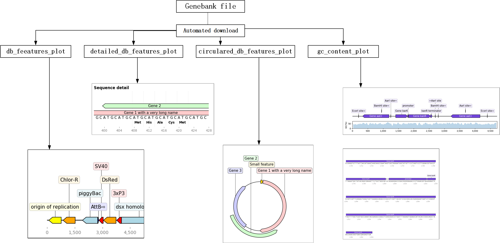

DNA注释自动化绘图（By 王頔）
=========================================

software installment
-----------------------------------

本软件在dna-features-viewer的基础上进行了二次开发。其依赖的软件包包括：dna_features_viewer、bokeh、pandas和bcbio-gff。建议在anaconda环境基础上进行。
建议参考资料：
 
- https://pypi.org/project/dna-features-viewer/0.1.8/ 
- https://github.com/Edinburgh-Genome-Foundry/DnaFeaturesViewer 
- https://github.com/VoigtLab/dnaplotlib

| **作者：王頔 朱振昊**
| **指导教师：夏梦雷**

-  pip install dna_features_viewer
-  pip install bokeh
-  pip install pandas
-  pip install bcbio-gff

将两个py文件放到当前文件夹或者python搜索路径即可。 

核心功能及用法
-----------------------------------------
Gff_object
~~~~~~~~~~~~~~~~~~~~~~~~~~~~~~~~~

本对象可以实现基因位置、类型等信息的快速绘制。 
该对象包含9个属性： 

- ID，代表序列ID，通常是染色体的ID，每条染色体拥有一个唯一的ID。默认值为：‘chrom1’
- Source，代表基因结构的来源，可以是数据库的名称，比如来自genebank数据库也可以是软件的名称，比如用Genescan软件预测得到，当然，也可以为空，用．点号填充。默认值为：‘custom’ 
- type，代表区间对应的特征类型，比如gene , exon等。默认值为：‘backbone’
- start，代表区间的起始位置。默认值为：0 
- end，代表区间的终止位置。默认值为：1 
- score，软件提供了统计值，如果没有，就用．填充。默认值为：‘.’ 
- strand，代表正负链的信息，+表示正链，-表示负链，?表示不清楚正负链的信息，当正负链信息没有意义时，可以用﹒填充。默认值为：‘+’
- phase，当描述的是CDS区间信息时，需要指定翻译时开始的位置，取值范围包括0，1，2。默认值为：‘.’
- name,默认值为：‘None_name’

**核心方法**
^^^^^^^^^^^^^^^^^^^^^^^^^^^^^^^^^^^^

1. object_quick_define(a,b,c)

-  用途：用于快速生成一个Gff_Object对象
-  参数：
   a:int类型，基因的起始位置
   b:int类型，基因的终止位置
   c:字符串类型，基因的名称
-  输出：
   输出一个含有基因起始位置a、基因终止位置b和基因名称c的Gff_Object默认对象

2. gff_write(a)

-  用途：用于将生成的Gff_object对象写入Gff文件 参数：
   a：如果省略，则追加一个新对象；如果为’w’则重新写入

3. object_delete(self)

-  用途：根据Gff_object的name 属性将对象进行删除

4. txt_generation()

-  用途：方法类属性，将Gff对象信息汇总成gff格式描述方式

5. simple_plot()

-  用途：绘制简易图

6. stick_figure_plot

-  用途：绘制指示功能模块的简易图

简单案例
^^^^^^^^^^^^^^

::

   from quick_class_plot_WD import Gff_Object
   # 导入quick_class_plot包

   xia=Gff_Object()
   # 建立一个Gff_Object对象

   xia.object_quick_define(200,300,'Gene A')
   xia.gff_write('w')
   # 绘制一个从200bp到300bp的基因A，并写入gff文件

   xia.object_quick_define(400,425,'promoter')
   xia.label='promoter'
   xia.gff_write()
   # 在400bp到425bp绘制一个启动子，并将其写入

   xia.object_quick_define(425,500,'GeneB')
   xia.strand='-'
   xia.gff_write()
   # 绘制一个从425bp到500bp的基因B，位于负链，并写入gff文件

   Gff_Object.simple_plot()
   #绘制具有指示功能模块的简易图

   xia.stick_figure_plot(xia.ID, 0, 500)
   # 由于stick figure中不含有backbone，如果有backbone，那么就不绘制图案
   # 为了美观，可在Gff_object后面加上labelsize=字符串大小，调整标注字体大小

gb_features_plot
~~~~~~~~~~~~~~~~~~~~

本函数可以基于genebank文件，进行自动绘制。与Gff_object相比，更加的简单。只需要了解7个函数即可（也就是6种绘图方式）

.. image:: Img/0002.png
   :align: center

核心用法
^^^^^^^^^^^^^^

1. file = file_get()

-  用途：用于自动下载或打开本地gb文件
-  如果以NCBI的基因号，则自动下载；如果无参数，则通过文件对话框，打开本地文件

2. db_feeatures_plot(file)

-  用途：直接绘制gb文件的特征图
-  参数：file为gb文件的路径，类型为字符串

3. detailed_db_features_plot(file, a, b)

-  用途：绘制详细的特征图
-  参数：file为gb文件的路径，类型为字符串
   a为所关注基因的起始位置，类型为int
   b为所关注基因的终止位置，类型为int

4. circulared_db_features_plot(file)

-  用途：绘制圆形的特征图
-  参数：file为gb文件的路径，类型为字符串

5. gc_content_plot(file)

-  用途：绘制包含基因特征和gc含量的图片
-  参数：file为gb文件的路径，类型为字符串

6. mult_line_page_plot(file)

-  用途：绘制详细基因信息，并导出pdf格式（也可以直接修改为想要的输出格式）
-  参数：file为gb文件的路径，类型为字符串

简单案例
^^^^^^^^^^^^^^

::

   from gb_features_plot import *

   file = file_get() #通过对话框打开带有注释的gb文件
   db_feeatures_plot(file)
   detailed_db_features_plot(file, 200, 250)
   circulared_db_features_plot(file)
   gc_content_plot(file)
   mult_line_page_plot(file)
   os.startfile("multiline_plot.pdf") # 输出为pdf格式