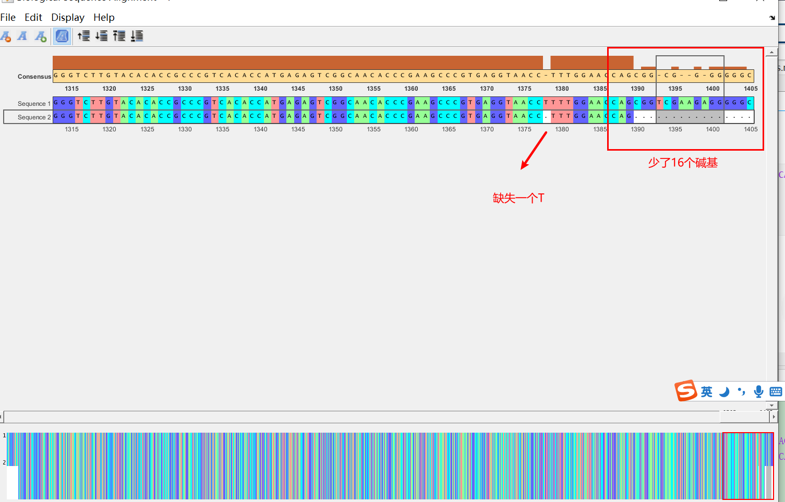

    背景说明：
    在正常的16s测序中，测序公司是将正相链和反向链同时测序，当两者出现相同序列后，则终止测序，将这两条链拼接，则为全链长度。

16s核糖体序列拼接实验
=================================================

1. 拼接思路
-----------

::

    graph TD
        A[swalign]-->B(匹配结果)
        B-->C{寻找最长的相同片段}
        C-->D[计算正反两条链在相同片段的各自部分]
        D-->E[完成拼接]

2.核心算法
----------

算法的核心是利用swalign寻找到最长的相同片段。为此，我们开发的了一个函数Same\_length

::

    function [Res] = Same_length(seq)
    % 本函数用于计算长度最长的重复序列，seq为Alignment的第二行，即由'|：-’组成的序列
    %   seq为序列，Res为包含最长连续片段的起点和终点组成的向量
    %   Copywrite by MTC, 2020.8.4, By Xia Menglei, Version 1.0

    Res=(seq~='|');
    po=find(Res==1);
    po1=diff(po);
    po2=find(po1==max(po1));
    Res=[po(po2)+1,po(po2+1)-1];
    end

Res返回的是共同序列在正链上的起始位点和终止位点。正义链是自己定的，一般公司会给出两条链，如果定义a为正，则b为负，反之亦然。只要保证全程都以该链为正即可。

3.具体实例 
----------------------
以我们课题组之前的一次实验为案例进行说明
 
3.1 数据读取
~~~~~~~~~~~~~~~~~~~~~~~~~~~~~~~~~~~
::

    zheng='GCCATGCGGCGTGCTTACCATGCAGTCGAGCGGGGAACTTCGGTTCCCAGCGGCGGACGGGTGAGTAACACGTGGGTAACCTACCTCATAGTGGGGAATAGCCTTTCGAAAGGAAGATTAATACCGCATAATACTCGAGAATCGCATGATTCTTGAGCCAAAGGATTTATTCGCTATGAGATGGACCCGCGGCGCATTAGCTTGTTGGTGAGGTAACGGCTCACCAAGGCTTCGATGCGTAGCCGACCTGAGAGGGTGATCGGCCACATTGGAACTGAGACACGGTCCAGACTCCTACGGGAGGCAGCAGTGGGGAATATTGCACAATGGGGGAAACCCTGATGCAGCAACGCCGCGTGAGTGATGAAGGTCTTCGGATCGTAAAACTCTGTCTTATGGGACGATAATGACGGTACCATAGGAGGAAGCCACGGCTAACTACGTGCCAGCAGCCGCGGTAATACGTAGGTGGCAAGCGTTGTCCGGATTTACTGGGCGTAAAGGATGTGTAGGCGGATATTTAAGTGAGATGTGAAATCCCCGGGCTTAACTTGGGGGCTGCATTTCAAACTGGATGTCTGGAGTGCAGGAGAGGAAGGCAGAATTCCTAGTGTAGCGGTGAAATGCGTAGAGATTAGGAAGAATACCAGTGGCGAAGGCGGCCTTCTGGACTGTAACTGACGCTGAGGCATGAAAGCGTGGGGAGCAAACAGGATTAGATACCCTGGTAGTCCACGCCGTAAACGATGAATACTAGGTGTAGGAGGTATCGACTCCTTCTGTGCCGCAGTTAACACAATAAGTATTCCGCCTGGGAAGTACGGTCGCAAGATTAAAACTCAAAGGAATTGACGGGGACCCGCACAAGCAGCGGAGCATGTGGTTTAATTCGAAGCAACGCGAAGAACCTTACCTAGACTTGACATCTCCTGAATTAGTCCGTAATGGATGAAGTCCCTTTCGGGACAGGATGACAGGTGGTGCATGGTTGTCGTCAGCTCGTGTCGTGAGATGTTGGGTTAAGTCCCGCACGAGCGCACCCTATCATAGTGCTAACATTAGTGAGCACTCTAGTGAGACTGCCGGTACGGGAGAAGGTGGGATGACGTCCAATTCATTCATTGCCCCTTATGTTCTAG';
    fan='GCCCCCTCTTCGACCGCTGGTTCCAAAAGGTTACCTCACGGGCTTCGGGTGTTGCCGACTCTCATGGTGTGACGGGCGGTGTGTACAAGACCCGGGAACGTATTCACCGCGACATTCTGATTCGCGATTACTAGCAACTCCGGCTTCATGTAGGCGAGTTTCAGCCTACAATCCGAACTGGGATGGGGTTTTGAGTTTTGCTCCACCTTGCGGTATTGCATCTTTTTGTCCCCACCATTGTAGCACGTGTGTAGCCCTAGACATAAGGGGCATGATGATTTGACGTCATCCCCACCTTCCTCCCGGTTAACCCGGGCAGTCTCACTAGAGTGCTCAACTAAATGTTAGCAACTAATGATAAGGGTTGCGCTCGTTGCGGGACTTAACCCAACATCTCACGACACGAGCTGACGACAACCATGCACCACCTGTCATCCTGTCCCCGAAGGGACTTCATCCATTACGGACTAATTCAGGAGATGTCAAGTCTAGGTAAGGTTCTTCGCGTTGCTTCGAATTAAACCACATGCTCCGCTGCTTGTGCGGGTCCCCGTCAATTCCTTTGAGTTTTAATCTTGCGACCGTACTTCCCAGGCGGAATACTTATTGTGTTAACTGCGGCACAGAAGGAGTCGATACCTCCTACACCTAGTATTCATCGTTTACGGCGTGGACTACCAGGGTATCTAATCCTGTTTGCTCCCCACGCTTTCATGCCTCAGCGTCAGTTACAGTCCAGAAGGCCGCCTTCGCCACTGGTATTCTTCCTAATCTCTACGCATTTCACCGCTACACTAGGAATTCTGCCTTCCTCTCCTGCACTCCAGACATCCAGTTTGAAATGCAGCCCCCAAGTTAAGCCCGGGGATTTCACATCTCACTTAAATATCCGCCTACACATCCCTTTACGCCCAGTAAATCCGGACACGCTTGCCACCTACGTATTACCGCGGCTGCTGGCACGTAGTTAGCGTGCTTCCTCCTATGGTACCGTCATTATCGTCCATAAGACAGAGTTTACGATCCGAAGACCTTCATCACTCACGCGCGTGCTGCATCAGGCTTTCCCCAATGGTGCATATTCCCATGCTGCCTCCCGTAGGATCTGGAACGGGTCTCAGTTTCCAATGGGGGCGAATACCCCTCTCTCAGGGTCGGGCTTA';

3.2 进行swalign，确定最长的相同部分
~~~~~~~~~~~~~~~~~~~~~~~~~~~~~~~~~~~

::

    fan1=seqrcomplement(fan);
    [Score, Alignment] = swalign(zheng, fan1);
     t=Alignment(2,:);
    Res = Same_length(t);
    Alignment1=Alignment(1,:);
    same_seq=Alignment1(Res(1):Res(2));

需要说明的是： -
Same\_length为自己开发的函数，该函数可以判断出Alignment中最长的相同序列，并返回该序列在zheng序列的起始和终止位置(Res)；
- same\_seq为最长的相同序列（以zheng为模板）

3.3 进行序列拼接
~~~~~~~~~~~~~~~~

::

    po1=strfind(zheng,same_seq);
    po2=strfind(fan,seqrcomplement(same_seq));
    seq_total=[zheng(1:po1-1),same_seq,seqrcomplement(fan(1:po2-1))];

**seq\_total即为拼接的结果**

4. 进行结果验证
---------------

4.1 直接与公司结果作比较
~~~~~~~~~~~~~~~~~~~~~~~~

::

    a='CTGGTTCCAAAGGTTACCTCACGGGCTTCGGGTGTTGCCGACTCTCATGGTGTGACGGGCGGTGTGTACAAGACCCGGGAACGTATTCACCGCGACATTCTGATTCGCGATTACTAGCAACTCCGGCTTCATGTAGGCGAGTTTCAGCCTACAATCCGAACTGGGATGGGGTTTTGAGTTTTGCTCCACCTTGCGGTATTGCATCTTTTTGTCCCCACCATTGTAGCACGTGTGTAGCCCTAGACATAAGGGGCATGATGATTTGACGTCATCCCCACCTTCCTCCCGGTTAACCCGGGCAGTCTCACTAGAGTGCTCAACTAAATGTTAGCAACTAATGATAAGGGTTGCGCTCGTTGCGGGACTTAACCCAACATCTCACGACACGAGCTGACGACAACCATGCACCACCTGTCATCCTGTCCCCGAAGGGACTTCATCCATTACGGACTAATTCAGGAGATGTCAAGTCTAGGTAAGGTTCTTCGCGTTGCTTCGAATTAAACCACATGCTCCGCTGCTTGTGCGGGTCCCCGTCAATTCCTTTGAGTTTTAATCTTGCGACCGTACTTCCCAGGCGGAATACTTATTGTGTTAACTGCGGCACAGAAGGAGTCGATACCTCCTACACCTAGTATTCATCGTTTACGGCGTGGACTACCAGGGTATCTAATCCTGTTTGCTCCCCACGCTTTCATGCCTCAGCGTCAGTTACAGTCCAGAAGGCCGCCTTCGCCACTGGTATTCTTCCTAATCTCTACGCATTTCACCGCTACACTAGGAATTCTGCCTTCCTCTCCTGCACTCCAGACATCCAGTTTGAAATGCAGCCCCCAAGTTAAGCCCGGGGATTTCACATCTCACTTAAATATCCGCCTACACATCCTTTACGCCCAGTAAATCCGGACAACGCTTGCCACCTACGTATTACCGCGGCTGCTGGCACGTAGTTAGCCGTGGCTTCCTCCTATGGTACCGTCATTATCGTCCCATAAGACAGAGTTTTACGATCCGAAGACCTTCATCACTCACGCGGCGTTGCTGCATCAGGGTTTCCCCCATTGTGCAATATTCCCCACTGCTGCCTCCCGTAGGAGTCTGGACCGTGTCTCAGTTCCAATGTGGCCGATCACCCTCTCAGGTCGGCTACGCATCGAAGCCTTGGTGAGCCGTTACCTCACCAACAAGCTAATGCGCCGCGGGTCCATCTCATAGCGAATAAATCCTTTGGCTCAAGAATCATGCGATTCTCGAGTATTATGCGGTATTAATCTTCCTTTCGAAAGGCTATTCCCCACTATGAGGTAGGTTACCCACGTGTTACTCACCCGTCCGCCGCTGGGAACCGAAGTTCCCCGCTCGACTGC';
    %a为公司给出的拼接结果

    [~,Alignment]=nwalign(seq_total,seqrcomplement(a));
    seqalignviewer(Alignment);

-  a为公司拼接的结果，seq\_total为使用我们的算法计算出的结果
-  可以看出，公司给出的拼接结果少了一个T，并且两端均少了很多碱基（如右边减少了16个碱基）

4.2 利用ATCC 824序列进行比对
~~~~~~~~~~~~~~~~~~~~~~~~~~~~

::

    fasta_download('NR_074511.2');
    seq=fastaread(['NR_074511.2','.fasta']).Sequence
    [Score1,Alignment1]=nwalign(seq_total,seq);
    seqalignviewer(Alignment1)

    [Score2,Alignment2]=nwalign(seqrcomplement(a),seq);
    seqalignviewer(Alignment2)

**说明：** 

A) fast\_download为我们开发的序列文件自动下载程序，见：https://mtc.readthedocs.io/en/latest/Gene/Primer\_blast.html#efetchncbi
#) 通过对比可以返现，我们的拼接结果优于公司结果，但是该序列仍旧与MTCC 824的16s序列有差异； 
#) **公司对上述差异给出的解释是：16s测序时，当开始的前30个序列检测是不准确的，因此在分析数据是，会直接将两条链的前30左右碱基去掉**
