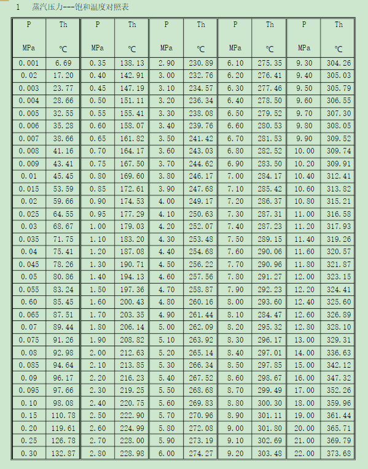

5.1 饱和蒸气压与汽爆强度计算
==================================

1. 饱和蒸汽压与汽爆对应关系
------------------------------

2. 汽爆强度计算公式
------------------------------

.. raw:: html
 
   

其中：

- t为时间，单位：min
- T为℃

3. 自动化计算
------------------------------
