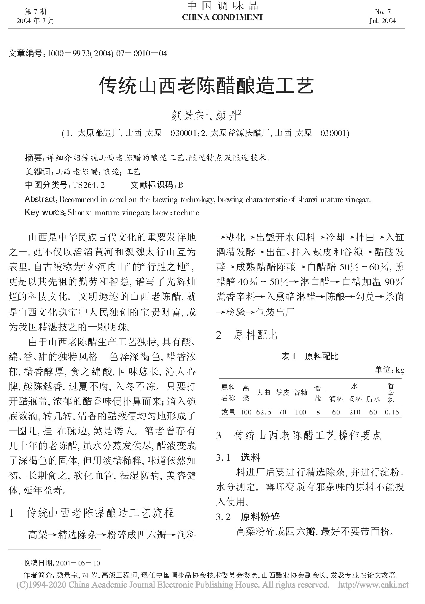
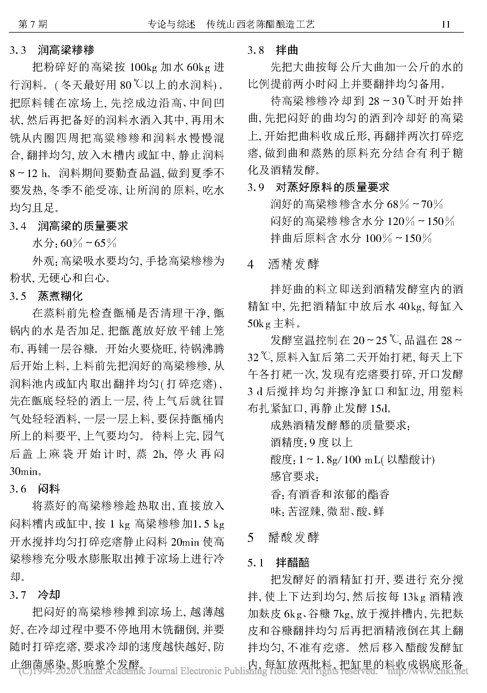
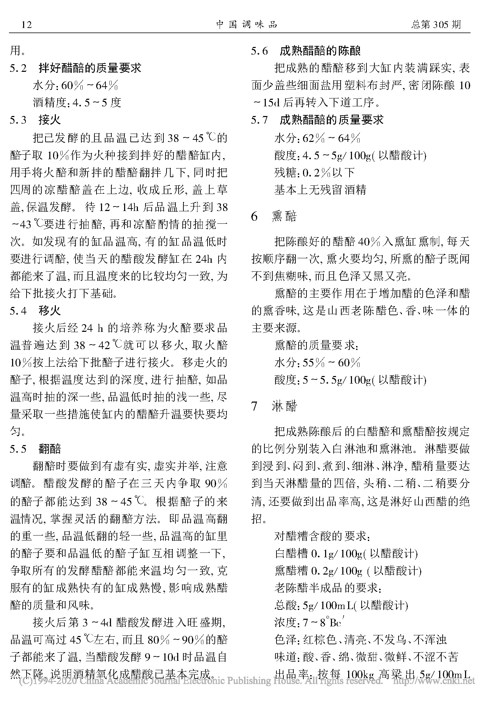
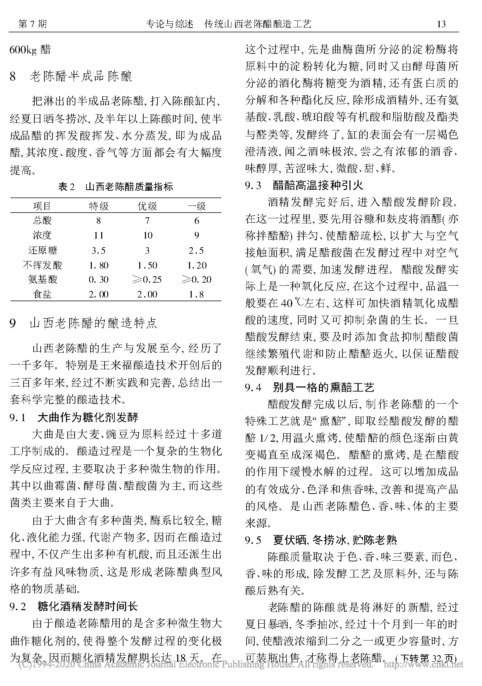
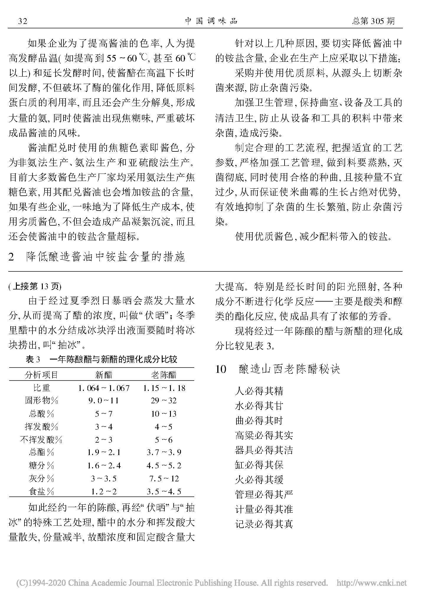

.. MTC documentation master file, created by
   sphinx-quickstart on Tue Aug  4 14:21:29 2020.
   You can adapt this file completely to your liking, but it should at least
   contain the root `toctree` directive.

山西老陈醋酿造工艺
===============================

**颜景宗,颜丹.传统山西老陈醋的酿造工艺[J].江苏调味副食品,2003(06):13-16.**

   

   


.. raw:: html

   

   

        
用户留言

        

        
<input id="myInput" type="text" placeholder="请输入留言类容"><button id="doPost">提交</button>

    

.. raw:: html

       

