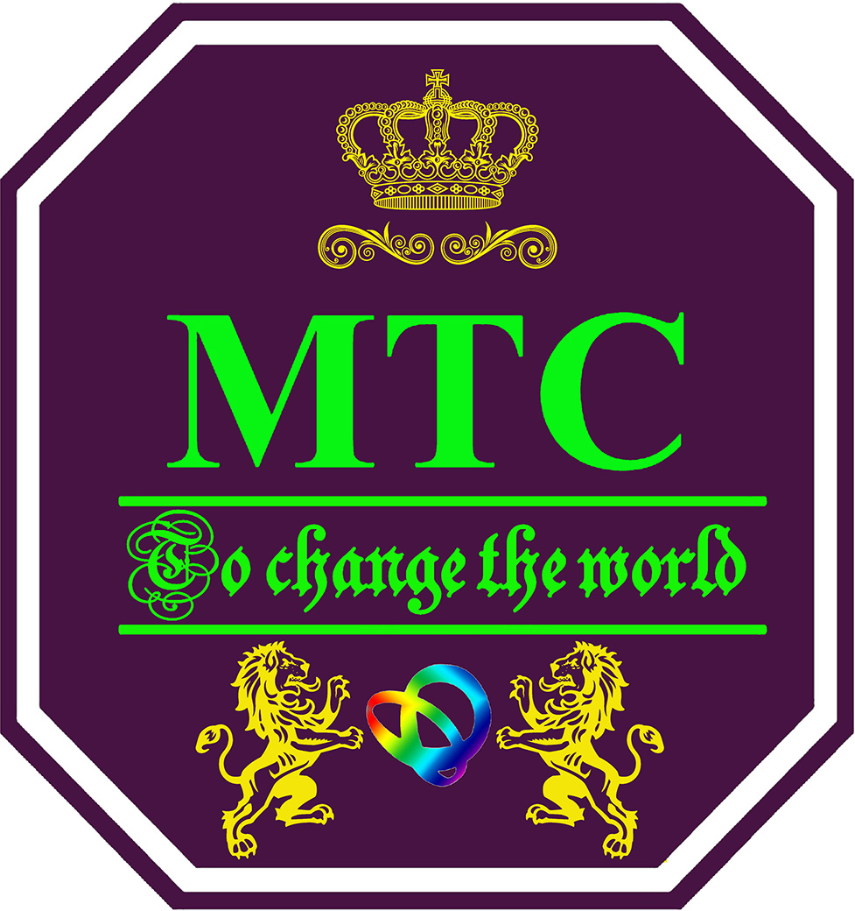

.. MTC documentation master file, created by
   sphinx-quickstart on Tue Aug  4 14:21:29 2020.
   You can adapt this file completely to your liking, but it should at least
   contain the root `toctree` directive.

Welcome to MTC's documentation!
===============================

本网站用于记录、整理科研过程中常见的研究思路、研究方法和研究技巧，帮助学生快速掌握编程知识和实验技能，使其更好地学习和科研。

MTC隶属天津科技大学生物学院微生物制药团队，该团队PI为王敏教授。本小组方向致力于计算机技术、工程技术和合成生物学技术的融合创新。学生在掌握传统生物工程、分子生物学的基础上，必须掌握编程技术，包括Matlab、R、Python、Java、Visual Basic的基础知识，并熟练运用相关知识，解决工程问题。我们的目标，是培养同时掌握科学知识与工程技术的 **“新工科人才”** 。

.. toctree::
   :maxdepth: 2
   :caption: Contents
   
   Gene/index
   Matlab/index
   Readthedocs维护/index

Indices and tables
==================

* :ref:`genindex`
* :ref:`modindex`
* :ref:`search`

- **You can contact us by:**  
- **Email:mlxia@tust.edu.cn**  
- **Tel：+86-022-60601256**
- **Tianjin University of Science & Technology, College of Biotechnology**
